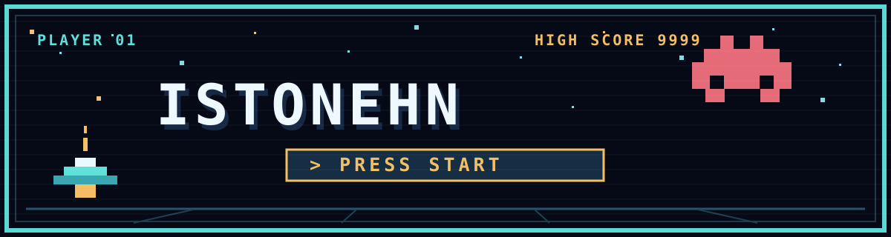

  

# STAR RUN

## Cómo juego

Pulso **INICIAR** con tres vidas. La primera cruz rosa que recojo me da una vida adicional, hasta cuatro; las siguientes me dan puntos.

1. **Órbita (2 minutos):** vuelo en todas las direcciones, destruyo naves y me cubro cuando empiezan a disparar. Los enemigos se aceleran con el tiempo.
2. **Desierto (2 minutos):** paso entre dunas cada vez más rápidas, rompo con disparos las dunas claras agrietadas y elimino a los aliens que salen de algunas de ellas.
3. **Laberinto (2 minutos y medio):** avanzo entre muros, derroto a los aliens que aparecen en el centro y disparo al jefe antes de que se termine el tiempo.

En computadora me muevo con **flechas o WASD** y disparo con **ESPACIO**. En móvil arrastro la nave en los dos primeros niveles; en el laberinto uso los controles táctiles.

[Jugar STAR RUN](https://istonehn.github.io/istonehn/arcade/)

## Tecnología

Lo construí con **HTML, CSS y JavaScript**, usando **Canvas** para el juego y un **Service Worker** para que funcione sin conexión después de la primera visita en línea.
